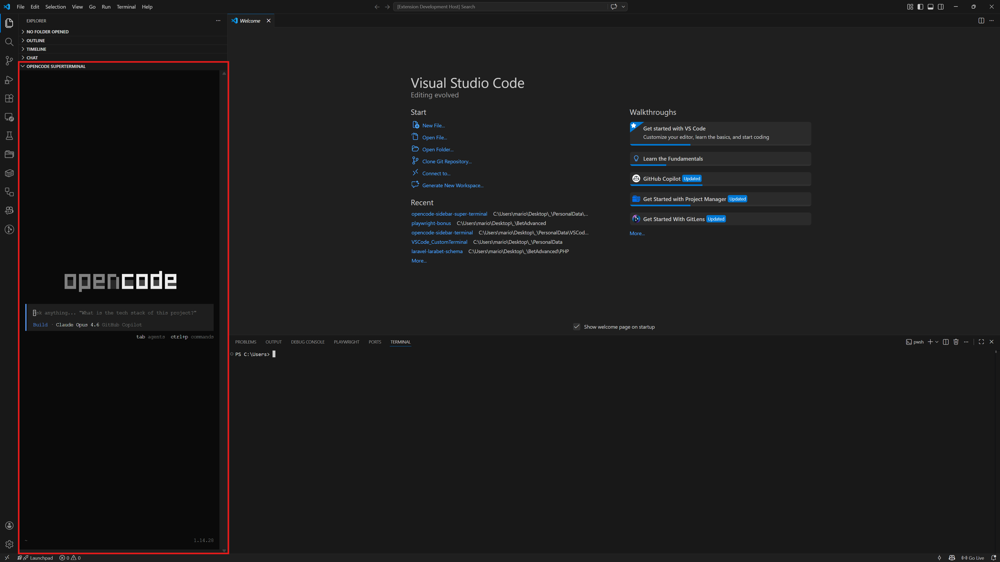

# OpenCode Sidebar SuperTerminal

Run [OpenCode](https://opencode.ai/) directly inside the VS Code **Explorer sidebar** — no need to switch to the built-in terminal panel. A fully interactive xterm.js terminal is embedded as a webview view, automatically launching `opencode` when the view is opened.

## Features

- **Sidebar-embedded terminal** — A persistent xterm.js terminal lives in the Explorer sidebar, keeping the bottom panel free for other tasks.
- **Auto-launches OpenCode** — The extension spawns `opencode` automatically when the view is opened; no manual commands needed.
- **Full terminal emulation** — Powered by [xterm.js](https://xtermjs.org/) v5 with canvas rendering, Unicode 11 support, cursor blinking, 256-color / true-color output, and 1,000-line scrollback.
- **Auto-fit & resize** — The terminal automatically adjusts its column/row dimensions when the sidebar is resized.
- **Workspace-aware** — Opens in the first workspace folder's directory (falls back to `USERPROFILE` or `cwd`).

## Requirements

| Requirement      | Details                                                                                                                                                             |
| ---------------- | ------------------------------------------------------------------------------------------------------------------------------------------------------------------- |
| **VS Code**      | `>=1.90.0`                                                                                                                                                          |
| **OpenCode CLI** | Must be installed and available on your `PATH`. Install from [opencode.ai](https://opencode.ai/).                                                                   |
| **node-pty**     | Bundled with VS Code; the extension uses the built-in copy. Falls back to a locally installed version if needed.                                                    |
| **OS**           | Windows, macOS, and Linux. On Windows the shell is resolved from `%ComSpec%` (falling back to `cmd.exe`); on macOS/Linux from `$SHELL` (falling back to `/bin/sh`). |

## How It Works

1. On activation the extension registers a **WebviewViewProvider** for the `opencodeSuperTerminalView` view in the Explorer sidebar.
2. When the view becomes visible, it:
   - Loads xterm.js and its addons (fit, canvas, unicode11) inside the webview.
   - Spawns a pseudo-terminal via `node-pty` using a platform-detected shell:
      - **Windows**: `%ComSpec%` (or `cmd.exe`) with args `/k opencode`
      - **macOS / Linux**: `$SHELL` (or `/bin/sh`) with args `-c opencode`
   - Bridges PTY ↔ webview with message passing (`input`, `output`, `resize`).
3. On dispose (panel closed / extension deactivated) the PTY process is killed.

## Extension Settings

This extension does not contribute any configurable settings at this time.

## Known Issues

- If `opencode` is not on `PATH`, the terminal will show an error after the shell starts.
- Canvas renderer may silently fall back to the default DOM renderer on some systems.

## Release Notes

### 1.0.0

- Initial release.
- Sidebar xterm.js webview with auto-launched OpenCode.
- Canvas rendering, Unicode 11, fit addon, and resize support.

## License

See [LICENSE](LICENSE) for details.
